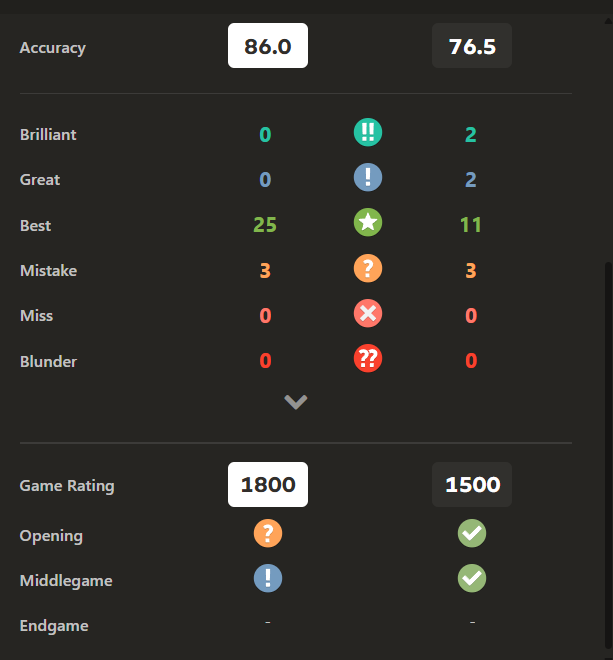

# ♟️ Custom Chess Engine (C++ & SDL)

A **from-scratch chess engine** written in **C++**, using **SDL2** for graphics and input handling. This project focuses on both **gameplay correctness** (legal move generation, special rules) and **engine intelligence** (evaluation, minimax, alpha-beta pruning, and optimizations).

## Project Overview

This engine is designed to:

* Render a complete chessboard using **SDL texture rendering**
* Allow **interactive drag-and-drop gameplay**
* Enforce **strict chess rules** for all pieces
* Provide a **fully functional AI opponent**
* Be fast, extensible, and educational for engine development

The long-term goal is to continuously improve **playing strength**, **search efficiency**, and **code clarity**, while keeping the engine understandable.

## Tech Stack

| Component        | Technology                   |
| ---------------- | ---------------------------- |
| Language         | C++                          |
| Graphics & Input | SDL2                         |
| Build System     | MinGW (`mingw32-make`)       |
| Platform         | Windows                      |
| AI Core          | Minimax + Alpha-Beta Pruning |

## How to Run (MinGW + VS Code)

### Prerequisites

* Windows OS
* MinGW installed
* SDL2 libraries set up

### Steps

1. Install MinGW Make

   * Download and run:

     ```
     mingw32-make-3.80.0-3.exe
     ```
   * Use the **default MinGW installation path**

2. Clone the repository

   ```sh
   git clone https://github.com/KunwarPrabhat/ChessEngine
   ```

3. Build and run

   ```sh
   cd ChessEngine
   cd src
   mingw32-make
   main.exe
   ```

---

## Current Features

###  Board & Rendering

* SDL-based chessboard rendering
* Texture-mapped chess pieces
* Smooth drag-and-drop interaction

###  Rules & Gameplay

* Legal move generation for all pieces
* Move validation and legality enforcement
* Kingside & Queenside castling
* Turn-based logic and rule enforcement

###  Artificial Intelligence

* Minimax search algorithm
* Alpha-Beta pruning for speed
* Board evaluation using:

  * Material values
  * Piece-square tables
* Move ordering (MVV-LVA heuristic)

---

## 📈 Engine Architecture (High-Level)

```
┌──────────────┐
│   SDL Input  │
└──────┬───────┘
       ↓
┌──────────────┐
│  Move Logic  │ ←── Legal move generation
└──────┬───────┘
       ↓
┌──────────────┐
│  Game State  │ ←── Board representation
└──────┬───────┘
       ↓
┌──────────────┐
│   AI Engine  │ ←── Minimax + Alpha-Beta
└──────┬───────┘
       ↓
┌──────────────┐
│  Evaluation  │ ←── Material + Position
└──────────────┘
```

---

##  AI Evaluation Model

The engine evaluates positions using a **scoring system**:

### Material Evaluation

| Piece  | Value |
| ------ | ----- |
| Pawn   | 100   |
| Knight | 320   |
| Bishop | 330   |
| Rook   | 500   |
| Queen  | 900   |
| King   | 20000 |

### Positional Evaluation

* Piece-square tables reward:

  * Central control
  * Active development
  * King safety
* Tables are mirrored for Black

This allows the engine to **prefer strong positional play**, not just material gain.

---

## Performance Optimization Techniques

* Alpha-Beta pruning (drastically reduces nodes searched)
* Move ordering (captures searched first)
* Early cutoffs using heuristic scores
* Memory reservation to avoid reallocations

### Search Depth vs Nodes Explored (Conceptual)

```
Depth 2  ███████
Depth 3  ██████████████
Depth 4  ██████████████████████
Depth 5  █████████████████████████████████
```

(Alpha-Beta pruning keeps this growth manageable)

---

## Completed & Pending Features

###  Implemented

* Piece movement logic
* Move validation and legality checks
* Kingside & Queenside castling
* AI move generation
* Engine strength improvements
* Performance optimizations

### Yet to add

* En passant

* Pawn promotion

* Opening book

## Performance Visualization

The image below shows a performance-related visualization (search depth, nodes explored, or profiling results):



## Learning Outcomes

This project demonstrates:

* Low-level engine design in C++
* Practical game AI implementation
* SDL-based rendering & input handling
* Performance-driven programming
* Real-world chess rule enforcement

---

## Contributions

Contributions, ideas, and optimizations are welcome. Feel free to fork, experiment, and improve the engine.
Currently the file structue is not modular so it might be a little confusing at first.

---

♟️ *Built to learn how real chess engines think — one move at a time.*
